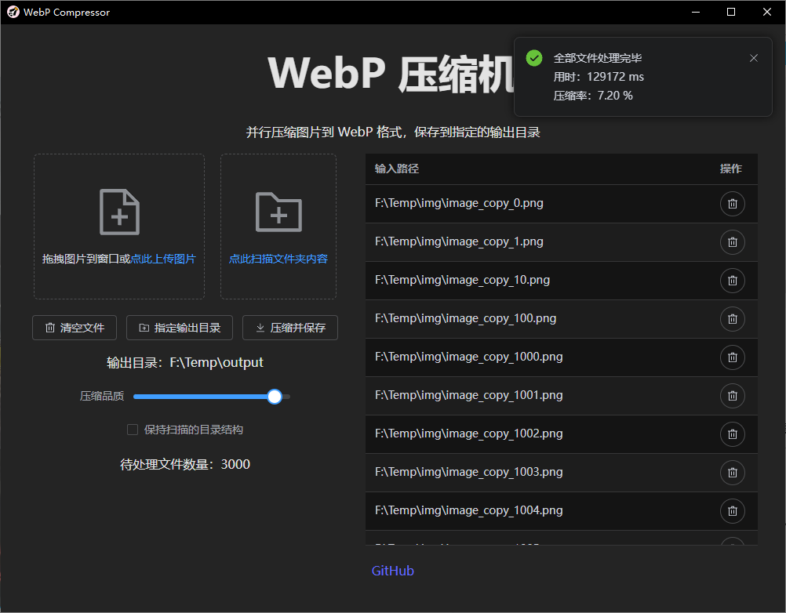
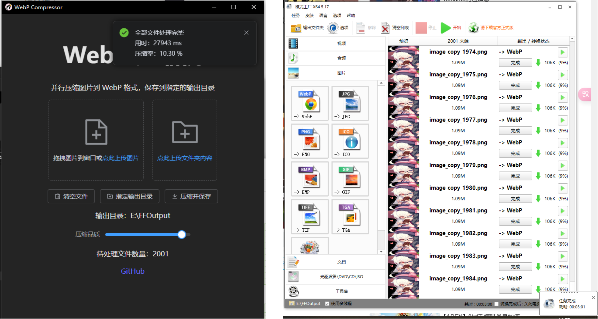

# WebP Compressor

WebP 压缩机是一个读取指定图片，将其按 WebP 重新压缩后保存的软件。得益于 Rust 高效的计算和并行能力，WebP 压缩机能够以很高的速度压缩图片。和其它压缩软件（如基于 `ffmpeg` 的格式工厂）相比，WebP 压缩机的压缩效率可以达到 **5 倍以上**，并且在压缩时造成更少的系统卡顿。

- **界面展示**：

   

- **效率对比**（和格式工厂对比、输入 2001 张 png 图像，分辨率 1280x1856）：

   

## 功能特性

- **高效压缩**：使用 Rust 编写，实现高效并行计算，确保极快的压缩速度。
- **多种输入格式**：支持 PNG、JPEG、BMP 等多种图片格式（只要 Rust 的图像处理库能够读取），将其压缩为 WebP 格式。
- **批量处理**：支持批量图片压缩，用户只需指定文件夹，软件将自动读取并扫描压缩其中的所有图片。
- **自定义输出路径**：用户可以指定压缩后图片的保存路径，方便管理和查找。
- **压缩质量调节**：提供压缩质量滑动条，用户可根据需求调节压缩质量与文件大小的平衡。
- **实时处理进度**：清晰显示当前处理文件数量及总进度，方便用户掌握压缩进展。
- **输入预览 & 调整**：提供输入文件的预览列表，可以通过按钮删去指定的输入。
- **保持文件结构**：对于扫描文件夹得到的输入，可以自动创建子文件夹，将输出图片按扫描时的文件结构输出。

## 使用方法

1. **添加输入**：
   - **选择图片**：拖拽图片到软件界面，或点击上传按钮，在文件浏览器中选择图片。
   - **选择文件夹**：点击上传文件夹按钮，在文件浏览器中选择文件夹。软件将扫描文件夹下的所有图片文件（包括子文件夹），添加到输入内容中。
2. **指定输出目录**：点击“指定输出目录”按钮，选择压缩后图片的保存位置。每次启动时，软件将自动读取上一次的输出目录。
   - **保留文件结构**：勾选“保留扫描的目录结构”，将在输出图片时自动创建子文件夹，从而保持图片相对于扫描时根目录的位置（而不是将所有文件平铺到输出目录中）。
3. **调整压缩质量**：通过滑动条调整压缩质量，默认设置已经能够满足大部分需求。
4. **开始压缩**：点击“压缩并保存”按钮，开始批量压缩图片。处理进度会在界面上实时显示。
